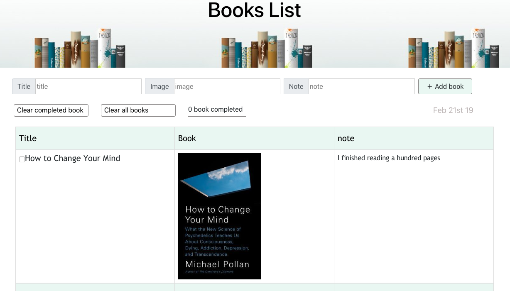

## Books List:
   Books List is the site to help readers to add their books that they want to read and allow to write their note about the book also clear the book after they finished reading.

## Requirements:
    * Add a new book to the list
    * Mark the book as complete
    * Remove book from the list
    * Clear all books
    * Clear only completed books

## Technologies
* React in Visual Studio Code

## Features
* allow user to add new data book
* allow user to delete only checked book 
* allow user to clear all books 
* show to the user how many books completed.

## The most difficult and favorite part
My favorite part on this project when I used map function to clear only the checked books from books list, map function help me to solve this problem because map function provide second argument as the index of the current element that help me to filter the book completed list easly.

## I would like to add next
* I will use api quotes and set it inside function that allow to get quotes randomly and show it on the page after each 10 seconds.
* I will make a website responsive.

## Acknowledgments
* @MicFin
* Ghadeer Alkhathlan
* @usmanbashir
* w3schools.com
* stackoverflow.com

